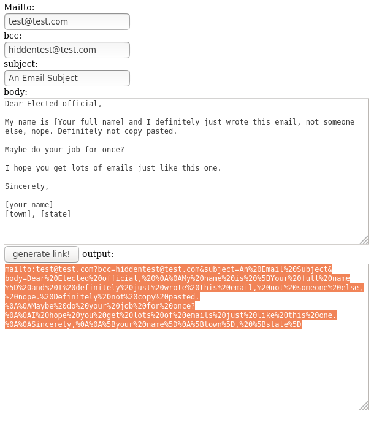
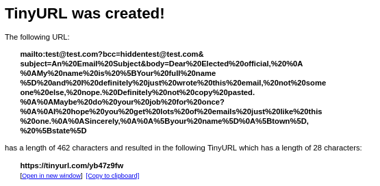
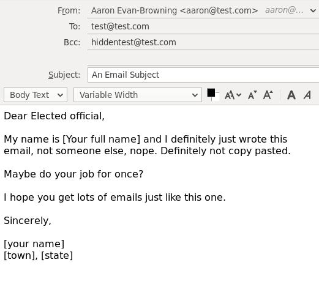

# email-link-generator

A simple html and javascript page to generate "mailto" format links.

Useful for getting people to bother their elected officials in a very convenient format.

Copy the output over into tinyurl to generate a clean link. I tried bit.ly but it didn't like the format.

Not my idea. I saw the link format on twitter but couldn't find the original post.

Plug in your info to the template:

Generate a tinyurl:

Clicking on your link produces the following your link to social media:

